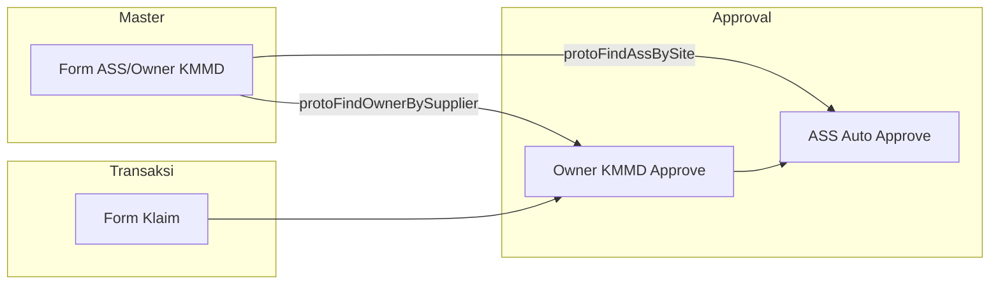
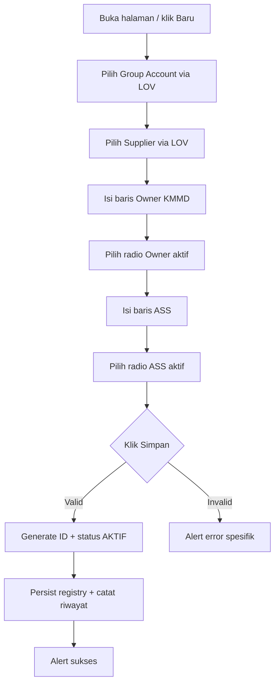
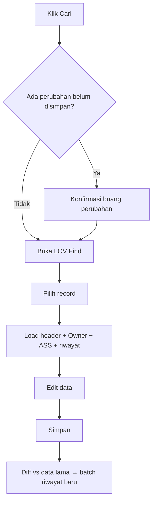
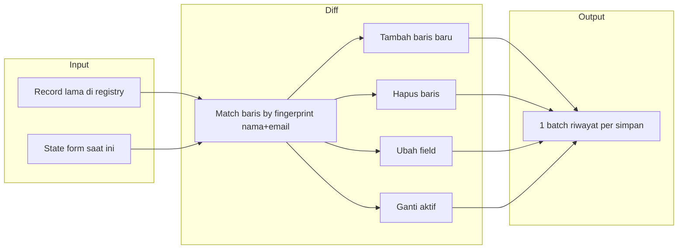
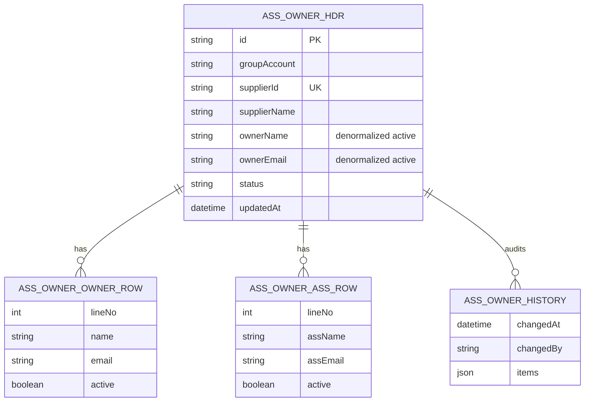

# Form Master ASS/Owner KMMD — Spesifikasi Lengkap

**Modul:** Master Data  
**Halaman:** Form Master ASS/Owner KMMD  
**Versi dokumen:** 1.0  
**Tanggal:** 30-Jun-2026  
**Audience:** Business Analyst, Solution Architect, Developer, QA, UAT  
**Referensi BRD:** `Docs/BRD-KICAO-KDS-Enhancement.md` — Bagian B  
**Prototype:** `Views/Master/AssOwnerKMMD/Index.html`

---

## Daftar Isi

1. [Ringkasan Eksekutif](#1-ringkasan-eksekutif)
2. [Konteks Bisnis](#2-konteks-bisnis)
3. [Ruang Lingkup](#3-ruang-lingkup)
4. [Stakeholder & Peran Pengguna](#4-stakeholder--peran-pengguna)
5. [Aturan Bisnis](#5-aturan-bisnis)
6. [Alur Proses](#6-alur-proses)
7. [Spesifikasi Layar](#7-spesifikasi-layar)
8. [Spesifikasi LOV (List of Value)](#8-spesifikasi-lov-list-of-value)
9. [Validasi & Pesan Error](#9-validasi--pesan-error)
10. [Riwayat Perubahan (Audit Trail)](#10-riwayat-perubahan-audit-trail)
11. [Model Data](#11-model-data)
12. [API & Integrasi](#12-api--integrasi)
13. [RBAC & Keamanan](#13-rbac--keamanan)
14. [UI/UX](#14-uiux)
15. [Gap Analysis: BRD vs Prototype vs Produksi](#15-gap-analysis-brd-vs-prototype-vs-produksi)
16. [Rekomendasi Implementasi Produksi](#16-rekomendasi-implementasi-produksi)
17. [Kriteria Penerimaan (UAT)](#17-kriteria-penerimaan-uat)
18. [Skenario Uji](#18-skenario-uji)
19. [Lampiran](#19-lampiran)

---

## 1. Ringkasan Eksekutif

Form Master **ASS/Owner KMMD** adalah modul master data yang menghubungkan **Supplier Subdistributor** (per Group Account) dengan:

- **Owner KMMD** — pemberi approval level 1 pada dokumen klaim (notifikasi email, approve manual)
- **ASS (Area Sales Supervisor)** — level approval level 2 (auto-approve setelah Owner approve)

Modul ini merupakan **prasyarat** alur approval klaim yang diperbarui (BRD Bagian A.3). Tanpa mapping yang valid, sistem tidak dapat menentukan penerima notifikasi email Owner maupun identitas ASS untuk auto-approve.

**Keputusan desain utama (prototype final):**

| Aspek | Keputusan |
|-------|-----------|
| Granularitas mapping | **Per Supplier** (bukan per site/branch seperti draft BRD awal) |
| Input Owner/ASS | **Freetext** nama + email (bukan LOV pegawai HRESS) |
| Multi-baris | Banyak baris Owner dan ASS per supplier; **tepat satu aktif** per role |
| Baris tidak aktif | Diarsipkan (tetap tersimpan, tidak dihapus dari database) |
| Audit | Riwayat perubahan per aksi Simpan, dikelompokkan Tambah / Hapus / Ubah / Aktifkan |

---

## 2. Konteks Bisnis

### 2.1 Masalah yang diselesaikan

Sebelum enhancement, alur approval klaim tidak mengenali Owner KMMD dan ASS sebagai level approval formal. Bisnis membutuhkan:

1. Mapping eksplisit supplier → Owner KMMD (untuk email approval)
2. Mapping eksplisit supplier → ASS aktif (untuk auto-approve administratif)
3. Kemampuan mengganti Owner/ASS seiring rotasi pegawai tanpa kehilangan jejak historis
4. Satu supplier hanya boleh punya **satu dokumen mapping aktif**

### 2.2 Hubungan dengan modul lain



| Modul | Ketergantungan ke ASS/Owner |
|-------|----------------------------|
| Form Klaim | Saat submit/approve, lookup Owner & ASS dari mapping supplier |
| Email notifikasi | Alamat email diambil dari baris **aktif** Owner |
| Approval history klaim | Nama ASS dari baris **aktif** |

### 2.3 Referensi BRD asli (Bagian B)

BRD awal mendefinisikan:

- Header: Group Account, Supplier ID/Name, Owner KMMD
- Detail per site/branch: Site, Branch, ASS, Region, Tipe Distributor
- Entitas: perluasan `XXSHP_KDS_M_KSUP_*` atau tabel baru `XXSHP_KDS_M_ASS_OWNER_*`

Prototype **menyederhanakan** menjadi mapping per supplier dengan tabel Owner dan ASS terpisah. Gap dan rekomendasi produksi dijelaskan di [§15](#15-gap-analysis-brd-vs-prototype-vs-produksi).

---

## 3. Ruang Lingkup

### 3.1 Dalam lingkup (In Scope)

| ID | Fitur |
|----|-------|
| F-01 | CRUD mapping ASS/Owner per supplier |
| F-02 | Find / buka mapping existing |
| F-03 | Multi-baris Owner KMMD dengan satu baris aktif |
| F-04 | Multi-baris ASS dengan satu baris aktif |
| F-05 | Validasi duplikat supplier |
| F-06 | Validasi format email |
| F-07 | Riwayat perubahan (audit trail) per simpan |
| F-08 | Integrasi lookup ke Form Klaim (prototype store) |
| F-09 | RBAC — akses menu & tombol per role |
| F-10 | Peringatan perubahan belum disimpan |

### 3.2 Di luar lingkup (Out of Scope) — prototype

| Item | Keterangan |
|------|------------|
| Backend Oracle / ASP.NET | Prototype pakai `localStorage` |
| LOV pegawai dari HRESS | Input freetext |
| Mapping per site/branch | Disederhanakan ke level supplier |
| Email engine nyata | Simulasi di Form Klaim |
| Halaman index/grid semua mapping | Hanya Find modal |
| Workflow approval di form master | Status hanya BARU / AKTIF |
| Delete dokumen mapping | Tidak ada tombol hapus header |

---

## 4. Stakeholder & Peran Pengguna

### 4.1 Persona bisnis

| Persona | Kebutuhan |
|---------|-----------|
| **Admin KMMD / IT Admin** | Membuat & maintain mapping supplier–Owner–ASS |
| **Owner KMMD** | Tidak mengakses form ini; menerima email dari mapping aktif |
| **ASS** | Tidak mengakses form ini; tercatat di mapping untuk auto-approve |
| **CF / RSM** | Tidak mengakses form ini; approval lanjutan setelah ASS |

### 4.2 Role sistem (prototype RBAC)

| Role ID | Label | Akses |
|---------|-------|-------|
| `IT_ADMIN` | IT Admin | Menu + Cari + Simpan + Baru |
| `ADMIN_KMMD` | Admin KMMD | Menu + Cari + Simpan + Baru |

Permission keys:

| Permission | Elemen UI |
|------------|-----------|
| `menu.master.assOwner` | Menu sidebar |
| `master.assOwner.find` | Tombol Cari |
| `master.assOwner.save` | Tombol Simpan |
| `master.assOwner.new` | Tombol Baru |

Role lain: menu disembunyikan, tombol disabled.

---

## 5. Aturan Bisnis

### 5.1 Aturan header dokumen

| ID | Aturan | Keterangan |
|----|--------|------------|
| BR-01 | Satu supplier hanya boleh punya **satu** mapping aktif | Validasi saat Simpan; cek duplikat `supplierId` |
| BR-02 | Group Account wajib dipilih sebelum Supplier | Supplier LOV difilter by group |
| BR-03 | Supplier wajib dipilih sebelum Simpan | |
| BR-04 | ID dokumen auto-generate saat simpan pertama | Format prototype: angka 4 digit random (1000–9999) |
| BR-05 | Tanggal dokumen = tanggal hari ini (read-only) | Format: `DD-MMM-YYYY` |
| BR-06 | Status `BARU` → `AKTIF` setelah simpan pertama berhasil | |

### 5.2 Aturan Owner KMMD

| ID | Aturan | Keterangan |
|----|--------|------------|
| BR-07 | Boleh ada **banyak baris** Owner per supplier | Untuk arsip pegawai lama |
| BR-08 | **Tepat satu** baris Owner berstatus aktif (radio) | Untuk notifikasi approval klaim |
| BR-09 | Baris Owner aktif: nama & email **wajib** diisi | |
| BR-10 | Baris Owner tidak aktif boleh kosong (arsip) atau terisi | |
| BR-11 | Minimal **satu baris** Owner (tidak boleh dihapus semua) | Tombol Hapus disabled jika hanya 1 baris |
| BR-12 | Nama & email disimpan **UPPERCASE** | Normalisasi saat blur & simpan |

### 5.3 Aturan ASS

| ID | Aturan | Keterangan |
|----|--------|------------|
| BR-13 | Boleh ada **banyak baris** ASS per supplier | |
| BR-14 | **Tepat satu** baris ASS berstatus aktif | Untuk auto-approve klaim |
| BR-15 | Baris ASS aktif: nama & email **wajib** diisi | |
| BR-16 | Minimal **satu baris** ASS | |
| BR-17 | ASS aktif = pegawai yang di-auto-approve setelah Owner approve klaim | |

### 5.4 Aturan penghapusan & aktivasi

| ID | Aturan | Keterangan |
|----|--------|------------|
| BR-18 | Hapus baris aktif: baris pertama otomatis jadi aktif | Konfirmasi khusus menjelaskan hal ini |
| BR-19 | Ganti radio aktif tidak menghapus baris lain | Baris lama menjadi arsip (abu-abu) |
| BR-20 | Tambah Owner/ASS memerlukan Group Account sudah terisi | |

### 5.5 Aturan integrasi klaim

| ID | Aturan | Keterangan |
|----|--------|------------|
| BR-21 | Lookup Owner: `groupAccount` + `supplierId` → Owner aktif | `protoFindOwnerBySupplier` |
| BR-22 | Lookup ASS: `groupAccount` + `supplierId` (opsional outlet) → ASS aktif | `protoFindAssBySite` |
| BR-23 | Mapping dengan `status != ACTIVE` tidak dipakai lookup | |

---

## 6. Alur Proses

### 6.1 Alur pembuatan mapping baru



### 6.2 Alur edit mapping existing



### 6.3 Alur diff riwayat (saat Simpan)



---

## 7. Spesifikasi Layar

**URL prototype:** `Views/Master/AssOwnerKMMD/Index.html`  
**Menu:** Master Data → Form ASS/Owner KMMD  
**Layout:** AdminLTE — 3 box utama + modal LOV

### 7.1 Content Header

| Elemen | Nilai |
|--------|-------|
| Judul | Form Master ASS/Owner KMMD |
| Subtitle | Mapping Supplier — Owner KMMD & ASS |
| Badge | NEW (fitur enhancement) |
| Legend | Dismissible — Enhancement BRD Jun 2026 |

### 7.2 Box 1 — Header Dokumen

#### Tombol aksi (kanan atas)

| Tombol | ID | Fungsi | Style |
|--------|-----|--------|-------|
| Cari | `#btnFind` | Buka LOV Find mapping | `btn-default` |
| Simpan | `#btnSave` | Validasi + persist | `btn-primary` |
| Baru | `#btnNew` | Reset form kosong | `btn-default` |

#### Field header

| Label UI | ID Element | Tipe | Wajib | Editable | Keterangan |
|----------|------------|------|-------|----------|------------|
| ID | `#txtID` | Text | — | Tidak | `[OTOMATIS]` — diisi saat simpan pertama |
| Tanggal | `#dtmDate` | Text | — | Tidak | Tanggal hari ini, `DD-MMM-YYYY` |
| Group Account | `#txtGroupAccount` | Text + LOV | Ya | Via LOV | Tombol search hijau |
| Status | `#lblStatus` | Label | — | — | `BARU` atau `AKTIF` (tampilan); registry: `NEW` / `ACTIVE` |
| Supplier ID | `#txtSupplierID` | Text | Ya | Via LOV | Read-only setelah pilih |
| Nama Supplier | `#txtSupplierName` | Text | Ya | Via LOV | Tooltip = nama penuh |

### 7.3 Box 2 — Mapping Owner KMMD & ASS

#### Summary bar (`#activeSummary`)

Menampilkan Owner dan ASS yang **sedang aktif** (nama + email). Update real-time saat radio berubah.

#### Tabel Owner KMMD (`#dtOwner`)

| Kolom | Lebar | Keterangan |
|-------|-------|------------|
| Aktif | 50px | Radio — satu pilihan (`name=ownerActive`) |
| No | 40px | Urutan 1-based |
| Nama Lengkap | 260px | Input freetext, uppercase |
| Email | 280px | Input freetext, validasi format |
| Hapus | 70px | Hapus baris (disabled jika 1 baris) |

**Tombol:** `Tambah Owner` — menambah baris kosong (non-aktif default)

**Visual state:**

| State | Background baris |
|-------|------------------|
| Aktif | `#fff8e6` (kuning muda) |
| Tidak aktif / arsip | `#f5f5f5` (abu) |

#### Tabel ASS (`#dtAss`)

Struktur identik dengan Owner; radio `name=assActive`.

**Tombol:** `Tambah ASS`

### 7.4 Box 3 — Riwayat Perubahan (`#boxHistory`)

| Properti | Nilai |
|----------|-------|
| Tipe | Accordion AdminLTE |
| Default | **Tertutup** (`collapsed-box`) |
| Badge | Jumlah **aksi simpan** (bukan jumlah field) |
| Tabel | DataTables `#dtHistory` |

#### Kolom DataTables riwayat

| Kolom | Keterangan |
|-------|------------|
| Tanggal | `DD-MMM-YYYY HH:mm` |
| User | Label role pengguna (`rbacGetRoleMeta().label`) |
| Detail Perubahan | HTML — kelompok aksi (lihat §10) |

**Fitur DataTables:** search, sort (default tanggal desc), pagination (5/10/25/50/Semua)

### 7.5 Modal LOV (`#lovModal`)

| Properti | Nilai |
|----------|-------|
| Posisi DOM | **Harus** di dalam `#app-content` |
| Judul dinamis | `#lovModalTitle` |
| Search | `#lovSearch` — filter client-side |
| Info | Menampilkan jumlah entri visible |

---

## 8. Spesifikasi LOV (List of Value)

### 8.1 Group Account

| Properti | Nilai |
|----------|-------|
| Trigger | Tombol search di field Group Account |
| Judul modal | Pilih Group Account |
| Kolom | Group Account, Kode Supplier |

**Data mock (prototype):**

| Group Account | Kode Supplier |
|---------------|---------------|
| KMMD | SPL-KMMD-003 |
| ENSEVAL | SPL-ENSEVAL-002 |
| BRAVO | SPL-BRAVO-001 |
| RM VI JATENG | SPL-RM6-004 |

**On pick:** Isi Group Account; **kosongkan** Supplier ID & Nama.

### 8.2 Supplier

| Properti | Nilai |
|----------|-------|
| Prasyarat | Group Account terisi |
| Judul modal | Pilih Supplier |
| Filter | `supplier.group === txtGroupAccount` |
| Kolom | ID Supplier, Nama Supplier, Group Account |

**On pick:** Isi Supplier ID & Nama; set tooltip nama.

### 8.3 Find (Cari Mapping)

| Properti | Nilai |
|----------|-------|
| Trigger | Tombol Cari (header) |
| Judul modal | Cari Mapping ASS/Owner |
| Sort | ID descending |
| Kolom | ID, Group Account, ID Supplier, Nama Supplier |

**On pick:** Load full record ke form; clear flag dirty.

**Peringatan:** Jika `formDirty`, konfirmasi *"Ada perubahan yang belum disimpan. Buka data lain?"*

---

## 9. Validasi & Pesan Error

### 9.1 Validasi saat Simpan

| Urutan | Kondisi | Pesan |
|--------|---------|-------|
| 1 | Group Account kosong | `Group Account wajib diisi!` |
| 2 | Supplier kosong | `Supplier wajib dipilih!` |
| 3 | Format email invalid (baris manapun) | `Periksa format email yang ditandai merah.` |
| 4 | Owner aktif != 1 | `Harus ada tepat satu Owner KMMD aktif (pilih radio).` |
| 5 | Nama Owner aktif kosong | `Nama Owner KMMD aktif wajib diisi!` |
| 6 | Email Owner aktif kosong | `Email Owner KMMD aktif wajib diisi!` |
| 7 | Email Owner aktif invalid | `Format email Owner KMMD aktif tidak valid!` |
| 8 | ASS aktif != 1 | `Harus ada tepat satu ASS aktif (pilih radio).` |
| 9 | Nama ASS aktif kosong | `Nama ASS aktif wajib diisi!` |
| 10 | Email ASS aktif kosong | `Email ASS aktif wajib diisi!` |
| 11 | Email ASS aktif invalid | `Format email ASS aktif tidak valid!` |
| 12 | Supplier duplikat | `Supplier ini sudah memiliki mapping ASS/Owner. Gunakan Cari untuk membuka data yang ada.` |

### 9.2 Validasi inline

| Field | Trigger | Perilaku |
|-------|---------|----------|
| Email | `onblur` | Border merah + teks "Format email tidak valid" |
| Nama / Email | `oninput` | Uppercase live (spasi dipertahankan) |
| Nama / Email | `onchange` / blur | Trim + uppercase |

**Regex email:** `/^[^\s@]+@[^\s@]+\.[^\s@]+$/`

### 9.3 Validasi aksi lain

| Aksi | Kondisi | Pesan |
|------|---------|-------|
| Tambah Owner/ASS | Group Account kosong | `Group Account harus diisi terlebih dahulu!` |
| Baru | — | `Buat form mapping baru?` atau dengan prefix unsaved changes |
| Cari | formDirty | `Ada perubahan yang belum disimpan. Buka data lain?` |
| Hapus baris aktif | — | `Baris ini sedang AKTIF. Setelah dihapus, baris pertama akan menjadi aktif.` |

### 9.4 Pesan sukses Simpan

```
Data mapping Owner KMMD & ASS berhasil disimpan!
{N} field diubah — tercatat 1 baris riwayat.
```

Jika tidak ada perubahan field: *"Tidak ada perubahan pada Owner/ASS."*

Riwayat accordion **auto-buka** jika ada perubahan baru.

---

## 10. Riwayat Perubahan (Audit Trail)

### 10.1 Konsep

- **Satu batch** = satu aksi **Simpan** yang menghasilkan perubahan
- Batch disimpan di array `changeHistory[]` pada record
- Batch terbaru di **indeks 0** (prepend)

### 10.2 Struktur batch

```typescript
interface ChangeHistoryBatch {
  changedAt: string;      // "DD-MMM-YYYY HH:mm"
  changedBy: string;      // e.g. "IT Admin"
  items: ChangeHistoryItem[];
}

interface ChangeHistoryItem {
  action: 'add' | 'delete' | 'edit' | 'aktif';
  role: string;           // e.g. "Owner #2", "ASS", "ASS #1"
  field: string;          // "Baris baru", "Nama", "Email", "Aktif", "Aktif (pindah)"
  oldValue: string;
  newValue: string;
}
```

### 10.3 Jenis aksi (action)

| Action | Label UI | Warna grup | Kapan tercatat |
|--------|----------|------------|----------------|
| `add` | Tambah | Hijau | Baris Owner/ASS baru ditambahkan & terisi |
| `delete` | Hapus | Merah | Baris dihapus dari form |
| `edit` | Ubah | Biru | Nama atau email berubah pada baris yang sama |
| `aktif` | Aktifkan | Kuning | Radio aktif berubah / pindah orang aktif |

### 10.4 Algoritma diff baris

1. **Match fingerprint** — `NAMA|EMAIL` uppercase untuk mendeteksi baris yang sama
2. **Match index** — baris di posisi sama jika fingerprint tidak cocok (handle rename)
3. Baris lama unmatched → **delete**
4. Baris baru unmatched → **add**
5. Pair matched → diff field → **edit** / **aktif**
6. Jika orang aktif berganti (fingerprint berbeda) → **aktif** `Aktif (pindah)`

### 10.5 Migrasi format lama

| Format | Ciri | Penanganan |
|--------|------|------------|
| Flat (legacy) | Satu item per field, tanpa `items[]` | Digabung by `changedAt + changedBy` |
| Batch (current) | Object dengan `items[]` | Langsung dipakai |
| Tanpa `action` | Item lama | Diinfer dari `field` |

### 10.6 Tampilan UI per batch

Satu baris DataTables berisi grup:

```
┌ Tambah (1) ─── hijau
│  ASS #2: Baris baru + NAMA (EMAIL)
├ Hapus (1) ─── merah
│  Owner #1: Baris − NAMA (EMAIL)
├ Ubah (2) ─── biru
│  ASS #1: Nama LAMA → BARU; Email LAMA → BARU
└ Aktifkan (1) ─ kuning
   ASS: Aktif ORANG_LAMA → ORANG_BARU
```

---

## 11. Model Data

### 11.1 Diagram relasi (konseptual)



### 11.2 Record registry — `AssOwnerRecord`

**Storage prototype:** `localStorage` key `kds_proto_ass_owner_registry`  
**Tipe:** `AssOwnerRecord[]`

| Field | Tipe | Wajib | Keterangan |
|-------|------|-------|------------|
| `id` | string | Ya | Primary key dokumen mapping |
| `groupAccount` | string | Ya | e.g. KMMD, ENSEVAL |
| `supplierId` | string | Ya | Unique per registry (BR-01) |
| `supplierName` | string | Ya | Denormalized |
| `ownerId` | string | Tidak | Kosong di prototype freetext |
| `ownerName` | string | Ya | Dari baris Owner **aktif** |
| `ownerEmail` | string | Ya | Dari baris Owner **aktif** |
| `status` | string | Ya | `ACTIVE` / `NEW` |
| `ownerRows` | array | Ya | Lihat §11.3 |
| `assRows` | array | Ya | Lihat §11.4 |
| `detailRows` | array | Ya | Kompatibilitas Klaim — lihat §11.5 |
| `changeHistory` | array | Tidak | Batch riwayat — §10 |
| `updatedAt` | ISO string | Ya | Setiap upsert |
| `seed` | boolean | Tidak | `true` = data seed prototype |

### 11.3 `ownerRows[]`

| Field | Tipe | Keterangan |
|-------|------|------------|
| `name` | string | UPPERCASE |
| `email` | string | UPPERCASE |
| `active` | boolean | Satu `true` per array |

### 11.4 `assRows[]`

| Field | Tipe | Keterangan |
|-------|------|------------|
| `assId` | string | Kosong di prototype |
| `assName` | string | = `name` |
| `assEmail` | string | = `email` |
| `name` | string | Duplikat untuk normalisasi |
| `email` | string | Duplikat untuk normalisasi |
| `active` | boolean | Satu `true` per array |

### 11.5 `detailRows[]` (kompatibilitas Klaim)

Derived saat simpan — satu entry per baris ASS:

```json
{
  "ownerId": "",
  "ownerName": "<active owner name>",
  "ownerEmail": "<active owner email>",
  "assId": "",
  "assName": "<ass row name>",
  "assEmail": "<ass row email>",
  "active": true|false
}
```

Digunakan `protoFindAssBySite` untuk fallback lookup.

### 11.6 Migrasi schema lama

| Data lama | Migrasi |
|-----------|---------|
| Hanya `ownerName` / `ownerEmail` di header | → `ownerRows: [{ name, email, active: true }]` |
| Hanya `detailRows` dengan ASS | → `assRows` dengan `active: true` pada indeks 0 |
| `changeHistory` flat | → batch grouped |

Fungsi: `migrateOwnerRowsFromRecord`, `migrateAssRowsFromRecord`, `normalizeChangeHistoryBatches`, `protoNormalizeAssOwnerRecord`

### 11.7 Seed data prototype

| ID | Group | Supplier ID | Supplier Name |
|----|-------|-------------|---------------|
| 1001 | KMMD | 3102 | AGUS JUSAK KURNIAWAN... |
| 1002 | KMMD | 3105 | BINTANG LIMA IMADA, PT |
| 1003 | ENSEVAL | 1709 | ENSEVAL PUTERA MEGATRADING, TBK PT |
| 1004 | KMMD | 3108 | KOMPAS SEJAHTERA, CV |
| 1005 | KMMD | 3106 | ANDARIA NIAGA, CV |
| 1006 | BRAVO | 2201 | PT BRAVO HUSADA |

Record `1003` memiliki 2 baris ASS (Bambang aktif, Andi arsip) — contoh multi-baris.

Contoh JSON lengkap: [02-sample-data.json](./02-sample-data.json)

---

## 12. API & Integrasi

### 12.1 Prototype store API (JavaScript global)

| Fungsi | Parameter | Return | Keterangan |
|--------|-----------|--------|------------|
| `protoGetAssOwnerRegistry()` | — | `AssOwnerRecord[]` | Semua mapping |
| `protoGetAssOwnerById(id)` | id | `AssOwnerRecord \| null` | |
| `protoUpsertAssOwner(record)` | record | `AssOwnerRecord` | Normalisasi + simpan |
| `protoDeleteAssOwner(id)` | id | boolean | Belum dipakai di UI |
| `protoFindOwnerBySupplier(ga, supplierId)` | groupAccount, supplierId | `{ ownerId, ownerName, ownerEmail, mappingId } \| null` | Owner aktif |
| `protoFindAssBySite(ga, siteOrOutlet, supplierId?)` | groupAccount, outlet, supplierId | `{ assId, assName, assEmail, mappingId } \| null` | ASS aktif |

### 12.2 Integrasi Form Klaim

| Titik integrasi | File | Fungsi |
|-----------------|------|--------|
| Owner approve | `Views/Klaim/Index.html` | `protoFindOwnerBySupplier(ga, sid)` |
| ASS auto approve | `Views/Klaim/Index.html` | `protoFindAssBySite(ga, outlet, sid)` |

**Contoh alur klaim:**

1. Klaim disubmit untuk supplier ENSEVAL `1709`
2. Sistem lookup Owner → HAFID / email dari mapping `1003`
3. Owner approve → sistem lookup ASS aktif → BAMBANG SUTRISNO
4. ASS auto-approve tercatat di approval history klaim

### 12.3 API produksi (rekomendasi FSD)

| Method | Endpoint (usulan) | Fungsi |
|--------|-------------------|--------|
| GET | `/api/master/ass-owner` | List dengan filter & paging |
| GET | `/api/master/ass-owner/{id}` | Get by ID |
| POST | `/api/master/ass-owner` | Create |
| PUT | `/api/master/ass-owner/{id}` | Update |
| DELETE | `/api/master/ass-owner/{id}` | Soft delete / inactive |
| GET | `/api/master/ass-owner/lookup/owner` | Query: groupAccount, supplierId |
| GET | `/api/master/ass-owner/lookup/ass` | Query: groupAccount, supplierId, site? |

---

## 13. RBAC & Keamanan

### 13.1 Autentikasi

- Prototype: `localStorage.kds_logged_in` + role di `sessionStorage`
- Halaman memerlukan login + role dipilih (`ChooseRole.html`)

### 13.2 Autorisasi

| Elemen | Permission |
|--------|------------|
| Menu Master ASS/Owner | `menu.master.assOwner` |
| Cari | `master.assOwner.find` |
| Simpan | `master.assOwner.save` |
| Baru | `master.assOwner.new` |

Implementasi: `rbacApplyAssOwnerPage()` di `rbac-prototype.js`

### 13.3 Keamanan data

| Aspek | Prototype | Produksi (rekomendasi) |
|-------|-----------|------------------------|
| PII (nama, email) | localStorage browser | Enkripsi at-rest, audit DB |
| CSRF | N/A | Token pada POST/PUT |
| XSS | `escHtml()` pada render | Server-side encoding |
| Duplikat supplier | Client validation | Unique constraint DB |

---

## 14. UI/UX

### 14.1 Prinsip desain

| Prinsip | Implementasi |
|---------|--------------|
| Konsistensi KDS | AdminLTE, hijau `#36752d`, box layout |
| Hierarki aksi | Simpan = primary, Cari/Baru = default |
| Status visual | Warna baris aktif vs arsip |
| Progressive disclosure | Riwayat accordion tertutup default |
| Bahasa Indonesia | Label aksi & pesan (Cari, Simpan, Baru, Hapus) |

### 14.2 Penilaian UX (internal)

| Aspek | Skor | Catatan |
|-------|------|---------|
| Tampilan | ~8.5/10 | Konsisten, badge NEW dismissible |
| Efektifitas | ~8.5/10 | Summary bar, unsaved warning, email validation |
| Gap produksi | Index/grid mapping | Belum ada halaman daftar |

### 14.3 Aksesibilitas

| Item | Status |
|------|--------|
| Radio area klik | Diperluas dengan `<label>` wrap |
| Tooltip supplier panjang | `title` attribute |
| Kontras warna riwayat | Grup aksi berwarna berbeda |

---

## 15. Gap Analysis: BRD vs Prototype vs Produksi

| Aspek | BRD Asli | Prototype Final | Rekomendasi Produksi |
|-------|----------|-----------------|----------------------|
| Granularitas | Per site/branch | Per supplier | **Keputusan bisnis** — konfirmasi apakah site masih diperlukan |
| Input Owner/ASS | LOV pegawai HRESS | Freetext nama+email | LOV HRESS + override manual? |
| Owner di header | Field tunggal | Denormalized dari baris aktif | Sama — denormalize untuk performa lookup |
| Detail grid site | Ada | Dihapus | Jika bisnis tetap butuh → tabel terpisah |
| ID Owner/ASS | Oracle employee ID | Kosong | Wajib di produksi |
| Storage | Oracle | localStorage | Oracle + API |
| Find | — | Modal LOV | Index page + filter |
| Delete dokumen | — | Tidak ada | Soft delete dengan konfirmasi |
| Email notifikasi | Email nyata | Simulasi alert | Integration email service |

---

## 16. Rekomendasi Implementasi Produksi

### 16.1 Opsi entitas database (dari BRD)

**Opsi 2 (disarankan untuk isolasi):**

```
XXSHP_KDS_M_ASS_OWNER_HDR
  INT_ASS_OWNER_HDR_ID PK
  TXT_GROUP_ACCOUNT
  INT_SUPPLIER_ID UK
  TXT_SUPPLIER_NAME
  TXT_OWNER_NAME_ACTIVE      -- denormalized
  TXT_OWNER_EMAIL_ACTIVE
  TXT_STATUS
  DTM_UPDATED

XXSHP_KDS_M_ASS_OWNER_OWNER_DTL
  INT_ASS_OWNER_HDR_ID FK
  INT_LINE_NO
  TXT_OWNER_NAME
  TXT_OWNER_EMAIL
  BIT_ACTIVE

XXSHP_KDS_M_ASS_OWNER_ASS_DTL
  INT_ASS_OWNER_HDR_ID FK
  INT_LINE_NO
  INT_ASS_EMP_ID             -- nullable jika freetext
  TXT_ASS_NAME
  TXT_ASS_EMAIL
  BIT_ACTIVE

XXSHP_KDS_M_ASS_OWNER_HIST
  INT_HIST_ID PK
  INT_ASS_OWNER_HDR_ID FK
  DTM_CHANGED
  TXT_CHANGED_BY
  TXT_ACTION_BATCH_JSON      -- atau tabel detail hist
```

### 16.2 Trigger bisnis produksi

| Trigger | Aksi |
|---------|------|
| After save mapping | Invalidate cache lookup klaim |
| Before save | Validasi unique supplier |
| On activate change | Log audit + optional email ke Owner baru |

### 16.3 Halaman tambahan yang disarankan

| Halaman | Fungsi |
|---------|--------|
| Index ASS/Owner | Grid semua mapping, filter GA/supplier/status |
| Export | Excel untuk audit |

---

## 17. Kriteria Penerimaan (UAT)

### 17.1 Header & LOV

- [ ] UAT-01: User dapat memilih Group Account dari LOV
- [ ] UAT-02: Supplier LOV hanya menampilkan supplier pada group terpilih
- [ ] UAT-03: Ganti Group Account mengosongkan supplier
- [ ] UAT-04: ID terisi otomatis setelah simpan pertama
- [ ] UAT-05: Status berubah BARU → AKTIF setelah simpan

### 17.2 Owner & ASS

- [ ] UAT-06: User dapat menambah banyak baris Owner dan ASS
- [ ] UAT-07: Hanya satu radio aktif per tabel
- [ ] UAT-08: Baris aktif tampil kuning, tidak aktif abu
- [ ] UAT-09: Summary bar menampilkan Owner & ASS aktif
- [ ] UAT-10: Tidak bisa hapus jika hanya tersisa 1 baris
- [ ] UAT-11: Hapus baris aktif → konfirmasi + baris pertama jadi aktif

### 17.3 Validasi

- [ ] UAT-12: Simpan gagal jika supplier duplikat
- [ ] UAT-13: Simpan gagal jika email format invalid
- [ ] UAT-14: Simpan gagal jika Owner/ASS aktif tanpa nama/email
- [ ] UAT-15: Peringatan unsaved saat Cari/Baru

### 17.4 Riwayat

- [ ] UAT-16: Satu simpan = satu baris riwayat
- [ ] UAT-17: Tambah/Hapus/Ubah/Aktifkan terkelompok dengan warna benar
- [ ] UAT-18: Riwayat auto-buka setelah simpan dengan perubahan
- [ ] UAT-19: DataTables search menemukan isi detail

### 17.5 Integrasi

- [ ] UAT-20: Klaim ENSEVAL 1709 menemukan Owner HAFID dari mapping 1003
- [ ] UAT-21: ASS aktif BAMBANG tercatat saat auto-approve klaim
- [ ] UAT-22: Role non-admin tidak melihat menu

---

## 18. Skenario Uji

### Skenario 1 — Buat mapping baru

| Step | Aksi | Ekspektasi |
|------|------|------------|
| 1 | Buka halaman | Form kosong, 1 baris Owner & ASS aktif |
| 2 | Pilih KMMD → Supplier 3102 | Header terisi |
| 3 | Isi Owner: BUDI, budi@x.com | Uppercase saat blur |
| 4 | Isi ASS: ANDI, andi@x.com | |
| 5 | Simpan | ID terisi, status AKTIF, alert sukses |

### Skenario 2 — Duplikat supplier

| Step | Aksi | Ekspektasi |
|------|------|------------|
| 1 | Buat mapping baru supplier 3102 (sudah ada 1001) | |
| 2 | Simpan | Alert duplikat, tidak tersimpan |

### Skenario 3 — Rotasi ASS dengan arsip

| Step | Aksi | Ekspektasi |
|------|------|------------|
| 1 | Cari record 1003 | 2 baris ASS load |
| 2 | Tambah ASS #3 RIZKY | Baris baru non-aktif |
| 3 | Pindah radio aktif ke RIZKY | Summary update |
| 4 | Simpan | Riwayat: Tambah + Aktifkan dalam 1 batch |

### Skenario 4 — Integrasi klaim

| Step | Aksi | Ekspektasi |
|------|------|------------|
| 1 | Buka klaim supplier ENSEVAL 1709 | |
| 2 | Trigger Owner approve | Alert menyebut Owner HAFID |
| 3 | Setelah Owner approve | ASS BAMBANG di auto-approve |

---

## 19. Lampiran

### 19.1 File source prototype

| File | Fungsi utama |
|------|--------------|
| `Views/Master/AssOwnerKMMD/Index.html` | UI + business logic form |
| `Scripts/customs/prototype/proto-store.js` | Registry, normalisasi, lookup, seed |
| `Scripts/customs/prototype/rbac-prototype.js` | Permission form |
| `Scripts/layout.js` | Menu, CSS/JS load, layout |

### 19.2 Event lifecycle halaman

```
DOM load
  → layout.js init
  → layoutReady event
    → initProtoLegend()
    → boxWidget.activate(#boxHistory)
    → initHistoryTable()
    → initiateBlank()
    → rbacApplyAssOwnerPage()
```

### 19.3 State form — `formDirty`

| Event | markDirty |
|-------|-----------|
| Input nama/email | Ya |
| Blur field | Ya |
| Ganti radio aktif | Ya |
| Tambah/hapus baris | Ya |
| Pilih LOV GA/Supplier | Ya |
| Simpan sukses | clearDirty |
| Load record / Baru | clearDirty |

### 19.4 Glosarium

| Istilah | Definisi |
|---------|----------|
| **KMMD** | Distributor Modern Trade — group account |
| **ASS** | Area Sales Supervisor |
| **Owner KMMD** | Pemilik approval level 1 klaim |
| **Mapping** | Dokumen hubungan supplier → Owner + ASS |
| **Baris aktif** | Baris dengan radio terpilih — dipakai operasional |
| **Arsip** | Baris non-aktif yang tetap disimpan |
| **Batch riwayat** | Kumpulan perubahan dari satu aksi Simpan |

### 19.5 Riwayat perubahan dokumen ini

| Versi | Tanggal | Penulis | Perubahan |
|-------|---------|---------|-----------|
| 1.0 | 30-Jun-2026 | — | Dokumen awal lengkap berdasarkan prototype final |

---

*Dokumen ini mencerminkan implementasi prototype per 30-Jun-2026. Untuk implementasi produksi, gunakan [§15 Gap Analysis](#15-gap-analysis-brd-vs-prototype-vs-produksi) dan [§16 Rekomendasi Produksi](#16-rekomendasi-implementasi-produksi) sebagai input FSD teknis.*
