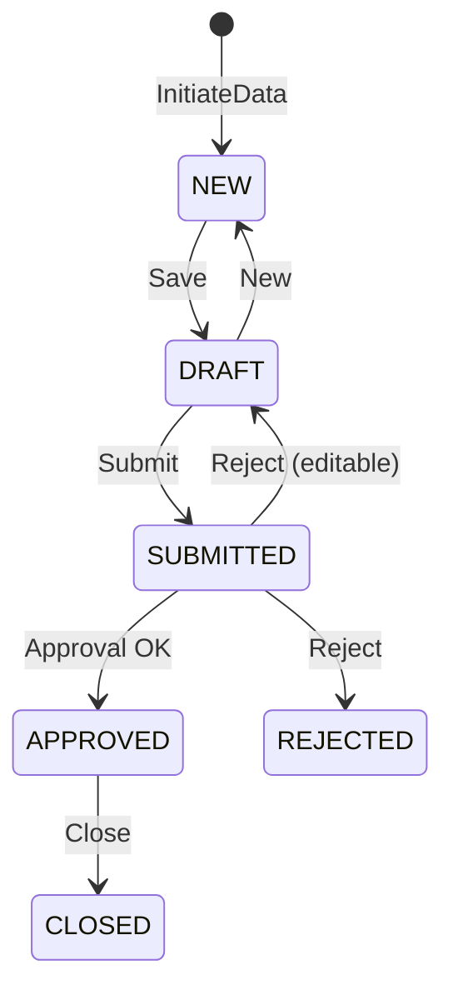

# Modul Klaim — Overview

## Tujuan Bisnis

Modul **Form Klaim** digunakan distributor/partner KICAO KDS untuk mengajukan klaim reimbursement atas aktivitas promosi/program marketing. Setiap klaim mencakup:

- Data header: group account, partner, outlet, supplier, branch
- Detail baris klaim per aktivitas/program dengan invoice & faktur pajak
- Alokasi nominal ke hierarki produk: **Umbrand → Brand/Subbrand → SKU**
- Workflow approval (draft → submit → approve/reject/close)
- Integrasi pajak: PPH, PPN, scan faktur pajak elektronik

## Layar & Navigasi

### 1. Form Klaim (`Index`)

Halaman utama transaksi klaim.

**Header form — field utama:**

| Field UI | Entity Field | Keterangan |
|----------|--------------|------------|
| ID / Doc No | `INT_KLAIM_HDR_ID` / `TXT_DOC_NO` | Auto-generate saat save |
| Date | `CREATION_DATE` | Tanggal pembuatan |
| Doc No MKPP | `TXT_DOCNO_MKPP` | Referensi dokumen MKPP (jika ada) |
| Status | `TXT_STATUSFLOW` | Alur status dokumen |
| Group Account | `TXT_GROUP_ACCOUNT` | LOV — wajib |
| Partner | `TXT_PARTNER` | LOV partner |
| Outlet | via outlet name | LOV — mengisi supplier & branch |
| Supplier Site | `INT_SUPPLIER_SITE_ID`, `TXT_SUPPLIER_SITE_NAME` | Auto dari group account |
| Supplier Code/Name | `TXT_SUPPLIER_CODE`, `TXT_SUPPLIER_NAME` | Auto |
| Branch | `TXT_BRANCH` | Auto dari outlet |
| Source | `TXT_SOURCE_DOC` | Mis. PORTAL KDS, BOSNET |
| Remark | `TXT_REMARK` | Catatan bebas |
| Ready to Submit | `BIT_READY_SUBMIT` | Y/N + alasan |

**Tombol aksi header:**

| Tombol | Fungsi |
|--------|--------|
| Find | Cari klaim by ID/doc no |
| Save | Simpan draft |
| Update Include | Update flag include pada detail |
| New | Reset form baru |
| Submit | Ajukan approval |
| Print | Cetak PDF klaim |
| Approval History | Riwayat approval (K2) |
| Close | Tutup dokumen + alasan |
| Reject | Tolak dokumen + alasan |
| Copy | Duplikasi klaim |
| View Memo | Preview memo klaim |

**Grid detail (`dtDetail`):**

| Kolom | Entity Field |
|-------|--------------|
| No | urutan baris |
| Activity | `TXT_ACTIVITY` |
| Program Desc | `TXT_PROGRAM_DESC` |
| Period From/To | `DTM_PERIOD_FROM`, `DTM_PERIOD_TO` |
| Invoice No/Date | `TXT_INVOICE_NO`, `DTM_INVOICE` |
| Faktur Pajak No/Date | `TXT_FKT_PJK_NO`, `DTM_FKT_PJK` |
| Invoice Amount | `DEC_INVOICE_AMT` |
| PPH Type / Tarif / Amount | `TXT_PPH_JENIS`, `DEC_PERSEN_PPH`, `DEC_PPH` |
| Final Amount | Invoice − PPH |
| PPN Type / Amount | `TXT_PPNTAXRATE_CODE`, `DEC_PPN` |
| Total Amount | Final + PPN |
| All Brand | `BIT_ALLBRAND` |
| Umbrand | link popup ke halaman Umbrand |
| Attachment | upload file per detail |
| Delete | hapus baris |
| Status | `TXT_STATUSKLAIM` |
| Description | `TXT_STATUS_DESC` |
| Include | `BIT_INCLUDE` |

**Perhitungan pajak (per baris detail):**

```
PPH Amount  = floor(Invoice Amount × Tarif PPH / 100)
Final Amount = Invoice Amount − PPH Amount
PPN Amount  = berdasarkan tipe PPN (dropdown dari master PPN)
Total Amount = Final Amount + PPN Amount
```

### 2. Klaim Umbrand (`Umbrand`) — Popup

Dibuka dari kolom Umbrand di grid detail (iframe/fancybox).

Menampilkan alokasi invoice amount ke level **Umbrand** dan **Brand**.

| Kolom Grid | Keterangan |
|------------|------------|
| No | urutan |
| Umbrand Name | LOV umbrand |
| Brand | LOV brand |
| All Subbrand | checkbox semua subbrand |
| Amount | nominal alokasi |
| Subbrand | tombol buka popup Brand |
| Delete | hapus baris |

### 3. Klaim Brand (`Brand`) — Popup

Dibuka dari baris Umbrand → kolom Subbrand.

Alokasi ke **Subbrand** level.

| Kolom Grid | Keterangan |
|------------|------------|
| No | urutan |
| SubBrand | LOV subbrand |
| All SKU | checkbox semua SKU |
| Amount | nominal |
| SKU | tombol buka popup SKU |
| Delete | hapus baris |

### 4. Detail SKU (`SKU`) — Popup

Dibuka dari baris Brand → kolom SKU.

Alokasi per item produk.

| Kolom Grid | Keterangan |
|------------|------------|
| No | urutan |
| Item Code | LOV item |
| Item Description | auto dari LOV |
| Amount | nominal per SKU |
| Delete | hapus baris |

### 5. Scan Faktur Pajak (`ScanFakturPajak`) — Popup

Input URL faktur pajak elektronik (DJP). Sistem mem-parse dan mengisi otomatis:

- Nomor faktur pajak
- Tanggal faktur
- Nilai DPP/PPN (jika tersedia)

## Alur Kerja Status



**Kontrol UI berdasarkan status:**

- `BIT_APPLY = Y` → dokumen sudah disubmit, field terkunci sebagian
- `BIT_APPROVED = Y` → fully approved, tombol edit disembunyikan
- `BIT_REJECTED = Y` → ditolak, form read-only
- `BIT_CLOSED = Y` → banner merah dengan `TXT_REASON_CLOSE`

### Alur Enhancement (Prototype RBAC — Jun 2026)

Untuk enhancement KICAO KDS (Owner/ASS approval eksternal, RSM Ready to Submit, CF Submit), prototype menggunakan alur status berbeda dari production di atas:

```
DRAFT → DRAFT WITH APPROVE → Ready to Submit → APPROVED
```

Dokumentasi lengkap: [07-workflow-rbac-external-approval.md](./07-workflow-rbac-external-approval.md)

## Integrasi Modul Lain

| Modul | Hubungan |
|-------|----------|
| RFA (Request For Advance) | Referensi klaim matching (`TXT_DOCNO_MKPP`) |
| CMA | Total klaim dihitung dari detail CMA |
| Klaim Pending | Update status per baris detail |
| Klaim Uploader | Bulk upload klaim dari Excel |
| MKPP Matching | LOV matching dokumen MKPP |
| BosNet API | Source doc BOSNET, tracking klaim |

## Role & LOV Khusus

- Role **1059/1060**: LOV Program Activity mengisi Activity + COA + PPH + Program Desc sekaligus
- Group Account **Enseval**: validasi khusus via `CekGroupAccountIsEnseval`
- Outlet LOV: `LOV_OUTLET` / `LOV_OUTLET_BY_SUP_SITE`

## File JavaScript Utama

| File | Tanggung jawab |
|------|----------------|
| `klaimscript.js` | Form utama, grid detail, save/submit, attachment, popup trigger |
| `umbrandscript.js` | Grid umbrand, navigasi ke Brand |
| `brandscript.js` | Grid subbrand, navigasi ke SKU |
| `skuscript.js` | Grid SKU/item |
| `scanfakturpajakscript.js` | Parse URL faktur pajak |
