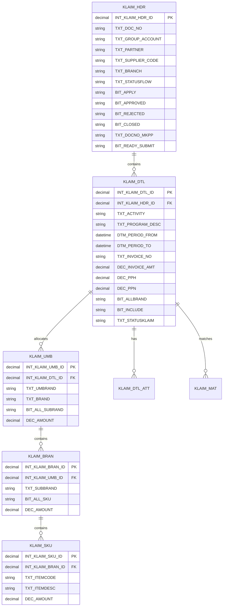

# Modul Klaim — Data Model

## Diagram Relasi



## XXSHP_KDS_T_KLAIM_HDR (Header)

Tabel utama dokumen klaim.

| Field | Tipe | Deskripsi |
|-------|------|-----------|
| `INT_KLAIM_HDR_ID` | decimal | Primary key |
| `TXT_DOC_NO` | string | Nomor dokumen klaim |
| `TXT_GROUP_ACCOUNT` | string | Nama group account distributor |
| `TXT_SITE` | string | Site |
| `INT_SUPPLIER_ID` | decimal | ID supplier Oracle |
| `TXT_SUPPLIER_NAME` | string | Nama supplier |
| `TXT_SUPPLIER_CODE` | string | Kode supplier |
| `INT_SUPPLIER_SITE_ID` | decimal | ID supplier site |
| `TXT_SUPPLIER_SITE_CODE` | string | Kode site |
| `TXT_SUPPLIER_SITE_NAME` | string | Nama site |
| `TXT_BRANCH` | string | Cabang |
| `TXT_REMARK` | string | Keterangan |
| `DEC_AMOUNT` | decimal | Total amount header |
| `TXT_STATUSFLOW` | string | Label status alur |
| `TXT_STATUSCODE` | string | Kode status |
| `BIT_APPLY` | string | Y/N sudah submit |
| `DTM_APPLY` | datetime | Waktu submit |
| `BIT_APPROVED` | string | Y/N approved |
| `BIT_REJECTED` | string | Y/N rejected |
| `TXT_REJECTREASON` | string | Alasan reject |
| `BIT_CLOSED` | string | Y/N closed |
| `TXT_REASON_CLOSE` | string | Alasan close |
| `TXT_PARTNER` | string | Nama partner |
| `TXT_SOURCE_DOC` | string | Sumber dokumen |
| `TXT_DOCNO_MKPP` | string | No dokumen MKPP |
| `TXT_DOCNO_ONO` | string | No dokumen ONO |
| `BIT_READY_SUBMIT` | string | Flag siap submit |
| `TXT_REASON_READY_SUBMIT` | string | Catatan ready submit |
| `INT_K2PROCESSID` | decimal | ID proses K2 approval |

**Navigation property:** `XXSHP_KDS_T_KLAIM_DTL` (collection)

## XXSHP_KDS_T_KLAIM_DTL (Detail)

Satu baris = satu aktivitas/invoice klaim.

| Field | Tipe | Deskripsi |
|-------|------|-----------|
| `INT_KLAIM_DTL_ID` | decimal | Primary key |
| `INT_KLAIM_HDR_ID` | decimal | FK header |
| `TXT_ACTIVITY` | string | Kode aktivitas |
| `TXT_PROGRAM_DESC` | string | Deskripsi program |
| `DTM_PERIOD_FROM` | datetime | Periode program awal |
| `DTM_PERIOD_TO` | datetime | Periode program akhir |
| `TXT_INVOICE_NO` | string | Nomor invoice |
| `DTM_INVOICE` | datetime | Tanggal invoice |
| `TXT_FKT_PJK_NO` | string | Nomor faktur pajak (format DJP) |
| `DTM_FKT_PJK` | datetime | Tanggal faktur pajak |
| `DEC_INVOICE_AMT` | decimal | Nilai invoice |
| `INT_PPH_DTL_ID` | decimal | FK master PPH |
| `TXT_PPH_JENIS` | string | Jenis PPH |
| `DEC_PERSEN_PPH` | decimal | Persentase PPH |
| `DEC_PPH` | decimal | Nilai PPH |
| `DEC_PPN` | decimal | Nilai PPN |
| `DEC_PPN_PERCENTAGE` | decimal | Persentase PPN |
| `TXT_PPNTAXRATE_CODE` | string | Kode tarif PPN |
| `BIT_ALLBRAND` | string | Y/N semua brand |
| `BIT_INCLUDE` | string | Y/N include dalam total |
| `TXT_STATUSKLAIM` | string | Status baris klaim |
| `TXT_STATUS_DESC` | string | Deskripsi status |

**Navigation properties:**
- `XXSHP_KDS_T_KLAIM_UMB` — alokasi umbrand
- `XXSHP_KDS_T_KLAIM_DTL_ATT` — lampiran file
- `XXSHP_KDS_T_KLAIM_MAT` — data matching

## XXSHP_KDS_T_KLAIM_UMB (Umbrand Allocation)

| Field | Tipe | Deskripsi |
|-------|------|-----------|
| `INT_KLAIM_UMB_ID` | decimal | Primary key |
| `INT_KLAIM_DTL_ID` | decimal | FK detail |
| `TXT_UMBRAND` | string | Nama umbrand |
| `TXT_BRAND` | string | Nama brand |
| `BIT_ALL_SUBRAND` | string | Y/N semua subbrand |
| `DEC_AMOUNT` | decimal | Nominal alokasi |

**Navigation:** `XXSHP_KDS_T_KLAIM_BRAN`

## XXSHP_KDS_T_KLAIM_BRAN (Subbrand Allocation)

| Field | Tipe | Deskripsi |
|-------|------|-----------|
| `INT_KLAIM_BRAN_ID` | decimal | Primary key |
| `INT_KLAIM_UMB_ID` | decimal | FK umbrand |
| `TXT_UMBRAND` | string | Umbrand (denormalized) |
| `TXT_SUBUMBRAND` | string | Sub umbrand |
| `TXT_BRAND` | string | Brand |
| `TXT_SUBBRAND` | string | Subbrand |
| `BIT_ALL_SKU` | string | Y/N semua SKU |
| `DEC_AMOUNT` | decimal | Nominal |

**Navigation:** `XXSHP_KDS_T_KLAIM_SKU`

## XXSHP_KDS_T_KLAIM_SKU (Item Allocation)

| Field | Tipe | Deskripsi |
|-------|------|-----------|
| `INT_KLAIM_SKU_ID` | decimal | Primary key |
| `INT_KLAIM_BRAN_ID` | decimal | FK brand |
| `TXT_ITEMCODE` | string | Kode item Oracle |
| `TXT_ITEMDESC` | string | Deskripsi item |
| `DEC_AMOUNT` | decimal | Nominal per item |

## Hierarki Alokasi Produk

```
Detail Klaim (DEC_INVOICE_AMT)
└── Umbrand[] (DEC_AMOUNT per umbrand)
    └── Brand/Subbrand[] (DEC_AMOUNT per subbrand)
        └── SKU[] (DEC_AMOUNT per item)
```

Total amount di setiap level harus konsisten dengan invoice amount detail (validasi di business logic layer).

## Tabel Staging & Upload

Modul upload bulk menggunakan tabel staging:

- `XXSHP_KDS_T_KLAIM_HDR_STG`
- `XXSHP_KDS_T_KLAIM_DTL_STG`
- `XXSHP_KDS_T_KLAIM_UMB_STG`
- `XXSHP_KDS_T_KLAIM_BRAN_STG`
- `XXSHP_KDS_T_KLAIM_SKU_STG`
- `XXSHP_KDS_T_KLAIM_UPL` — header upload file
