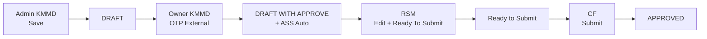

# Modul Klaim — Workflow RBAC & External Approval

> **Terakhir diperbarui:** 30 Juni 2026  
> **Acuan kode:** `Views/Klaim/Index.html`, `Scripts/customs/prototype/rbac-prototype.js`, `Scripts/customs/prototype/proto-store.js`

Dokumen ini menjelaskan **alur status klaim**, **RBAC per role**, **approval eksternal (email + OTP)**, dan **hak edit field** di prototype `kicaokds.kalbenutritionals`.

---

## 1. Ringkasan Alur Bisnis

Prototype mensimulasikan enhancement KICAO KDS di mana **Owner KMMD** dan **ASS** melakukan approval **di luar sistem** (via email + OTP), sementara **RSM** dan **CF** tetap bekerja di dalam aplikasi.



| Langkah | Role | Aksi UI | Status Hasil | Lokasi |
|---------|------|---------|--------------|--------|
| 1 | Admin KMMD | **Save** | `DRAFT` | Form Klaim (in-app) |
| 2 | Owner KMMD | **OTP** (email eksternal) | `DRAFT WITH APPROVE` | `ApprovalEmail.html` → `ApprovalOtp.html` |
| 2b | ASS | **(Auto)** — tidak perlu OTP terpisah | `DRAFT WITH APPROVE` | Otomatis saat Owner OTP |
| 3 | RSM | **Edit data** + **Ready To Submit** | `Ready to Submit` | Form Klaim (in-app) |
| 4 | CF | **Submit** | `APPROVED` | Form Klaim (in-app) |

---

## 2. Konstanta Status (`KLAIM_STATUS`)

Didefinisikan di `Views/Klaim/Index.html`:

| Konstanta JS | Nilai `TXT_STATUSFLOW` | Warna label | Keterangan |
|--------------|------------------------|-------------|------------|
| `NEW` | `NEW` | biru | Form baru, belum disimpan |
| `DRAFT` | `DRAFT` | kuning | Setelah Admin Save |
| `DRAFT_WITH_APPROVE` | `DRAFT WITH APPROVE` | teal | Setelah Owner OTP (+ ASS auto) |
| `READY_TO_SUBMIT` | `Ready to Submit` | ungu | Setelah RSM Ready To Submit |
| `APPROVED` | `APPROVED` | biru | Setelah CF Submit final |

### 2.1 Normalisasi status lama (`normKlaimStatus`)

Fungsi `normKlaimStatus()` memetakan status legacy agar data lama di `localStorage` tetap kompatibel:

| Status lama | Dipetakan ke |
|-------------|--------------|
| `DRAFT WITH 2 APPROVE` | `DRAFT WITH APPROVE` |
| `APPROVE 1 - DRAFT` | `DRAFT WITH APPROVE` |
| `APPROVE 2 - DRAFT` | `DRAFT WITH APPROVE` |
| `DRAFT WITH 3 APPROVE` | `Ready to Submit` |
| `READY TO SUBMIT` (uppercase) | `Ready to Submit` |

---

## 3. Role & Permission (RBAC)

Definisi role ada di `Scripts/customs/prototype/rbac-prototype.js`.

### 3.1 Daftar role

| Role ID | Label | Deskripsi singkat |
|---------|-------|-------------------|
| `IT_ADMIN` | IT Admin | Akses penuh (demo/testing) |
| `ADMIN_KMMD` | Admin KMMD | Buat & simpan klaim → DRAFT |
| `OWNER_KMMD` | Owner KMMD | Approve eksternal → Draft With Approve |
| `ASS` | ASS | Auto approve bersama Owner (tanpa aksi manual) |
| `RSM` | RSM | Edit klaim + Ready To Submit |
| `CF` | CF (Finance) | Submit klaim Ready to Submit → Approved |

Role dipilih setelah login di `Views/Account/ChooseRole.html` dan disimpan di `localStorage.kds_active_role`.

### 3.2 Matrix permission utama

| Permission | Role yang diizinkan | Dipakai untuk |
|------------|---------------------|---------------|
| `klaim.save` | IT_ADMIN, ADMIN_KMMD | Tombol Save |
| `klaim.new` | IT_ADMIN, ADMIN_KMMD | Tombol New |
| `klaim.editHeader` | IT_ADMIN, ADMIN_KMMD | Edit header + LOV (saat NEW/DRAFT) |
| `klaim.addDetail` | IT_ADMIN, ADMIN_KMMD | Tambah baris detail (Admin) |
| `klaim.ownerApprove` | IT_ADMIN, OWNER_KMMD | Tombol Email/Approve (simulasi in-app) |
| `klaim.rsmEdit` | IT_ADMIN, RSM | Edit remark + detail (saat Draft With Approve) |
| `klaim.readySubmit.edit` | IT_ADMIN, RSM | Field Ready to Submit Y/N + alasan |
| `klaim.rsmReadySubmit` | IT_ADMIN, RSM | Tombol Ready To Submit |
| `klaim.cfSubmit` | IT_ADMIN, CF | Tombol Submit final |
| `klaim.payment.edit` | IT_ADMIN, CF | Kolom payment status / paid date / bank |
| `klaim.find` | Semua role | Tombol Find |
| `klaim.approvalHistory` | Semua role | Tombol Approval History |

### 3.3 Tombol yang tampil per status

Logika di `applyKlaimWorkflowByRole()` (`Index.html`):

| Status | Tombol aktif (sesuai permission) |
|--------|----------------------------------|
| `NEW` / `DRAFT` | Save, New, Find, Print, View Memo |
| `DRAFT` | + Owner Approve (Owner KMMD) |
| `DRAFT WITH APPROVE` | Find, Print, View Memo, Approval History, **Ready To Submit** (RSM) |
| `Ready to Submit` | Find, Print, View Memo, Approval History, **Submit** (CF) |
| `APPROVED` | Find, Print, View Memo, Approval History |

---

## 4. Filter Find per Role

Fungsi `getFindRowsForRole()` memfilter registry sebelum ditampilkan di modal Find:

| Role | Hanya menampilkan status |
|------|--------------------------|
| `OWNER_KMMD` | `DRAFT` |
| `RSM` | `DRAFT WITH APPROVE` |
| `CF` | `Ready to Submit` |
| `IT_ADMIN`, `ADMIN_KMMD`, `ASS` | Semua status |

---

## 5. Hak Edit Field per Role & Status

Logika di `applyKlaimFieldAccessByRole()`:

| Area form | Admin (NEW/DRAFT) | RSM (Draft With Approve) |
|-----------|-------------------|--------------------------|
| Header (Group Account, Outlet, Partner, dll.) | ✅ editable + LOV | ❌ readonly |
| Remark | ✅ | ✅ |
| Grid detail (activity, amount, PPH, dll.) | ✅ | ✅ |
| Tambah / hapus baris detail | ✅ | ✅ |
| Ready to Submit (Y/N + alasan) | ✅ (saat DRAFT) | ✅ |
| Payment fields | CF saja (status tertentu) | — |

RSM **tidak** punya tombol Save — perubahan disimpan ke `sessionStorage` via `syncToStorage()`, lalu di-persist ke registry saat klik **Ready To Submit** (`persistActiveClaimToRegistry()`).

---

## 6. External Approval (Email + OTP)

Prototype mensimulasikan alur approval Falcon SKP (landing page OTP) dengan halaman terpisah di luar shell AdminLTE.

### 6.1 File terkait

| File | Fungsi |
|------|--------|
| `Views/Klaim/ApprovalEmail.html` | Simulasi email ke Owner KMMD — berisi ringkasan klaim, kode OTP, link ke halaman OTP |
| `Views/Klaim/ApprovalOtp.html` | Halaman verifikasi OTP — submit OTP (prototype: **OTP apa pun diterima**) |
| `Scripts/customs/prototype/proto-store.js` | OTP helpers + update status registry |

### 6.2 Alur setelah Admin Save

```
Admin KMMD klik Save
    │
    ├─► Status tetap DRAFT
    ├─► persistActiveClaimToRegistry()
    ├─► protoEnsureKlaimOtp(claimId, 'owner') — generate OTP 6 digit
    └─► window.open('ApprovalEmail.html?claimId=...&step=owner')
```

### 6.3 Alur Owner OTP

```
Owner buka link dari email → ApprovalOtp.html?claimId=...&step=owner
    │
    └─► Klik Submit (OTP apa pun valid di prototype)
            │
            ├─► protoApplyKlaimStatus(claimId, 'DRAFT WITH APPROVE', { BIT_APPLY: 'Y' })
            ├─► History: Owner — OTP Approve (External)  DRAFT → DRAFT WITH APPROVE
            └─► History: ASS — Auto Approve              DRAFT WITH APPROVE → DRAFT WITH APPROVE
```

**ASS tidak punya langkah OTP terpisah.** Link lama `step=ass` menampilkan pesan bahwa ASS sudah di-approve otomatis.

### 6.4 Simulasi in-app (tanpa email)

Owner KMMD yang login di aplikasi dapat juga klik tombol **Email / Approve** (`handleOwnerApprove()`) — hasilnya sama: status `DRAFT WITH APPROVE` + ASS auto di history.

### 6.5 Sinkronisasi form aktif

Jika tab Form Klaim masih terbuka saat OTP disubmit:

- `protoApplyKlaimStatus()` memperbarui registry **dan** `sessionStorage.klaimPrototypeData` jika claim sedang aktif
- Form Klaim juga mendengarkan event `window.focus` dan `storage` untuk `reloadActiveClaimFromRegistry()`

---

## 7. Handler Workflow (In-App)

| Handler | Role | Prasyarat status | Status hasil |
|---------|------|------------------|--------------|
| `handleSave()` | Admin KMMD | validasi form | `DRAFT` |
| `handleOwnerApprove()` | Owner KMMD | `DRAFT` | `DRAFT WITH APPROVE` |
| `handleRsmReadySubmit()` | RSM | `DRAFT WITH APPROVE` + validasi lengkap | `Ready to Submit` |
| `handleCfSubmit()` | CF | `Ready to Submit` + validasi lengkap | `APPROVED` |

### Pesan konfirmasi RSM

Dialog konfirmasi Ready To Submit hanya menampilkan teks: **"Ready To Submit"** (tanpa menyebut status teknis).

---

## 8. Penyimpanan Data (Registry)

### 8.1 localStorage keys

| Key | Isi |
|-----|-----|
| `kds_proto_klaim_registry` | Array record klaim (header, detail, findSummary, approvalHistory) |
| `kds_proto_ass_owner_registry` | Mapping ASS & Owner KMMD per supplier/site |
| `kds_proto_meta` | Metadata seed (`schemaVersion`, `klaimSeedRevision`) |
| `kds_active_role` | Role RBAC aktif |
| `kds_logged_in` / `kds_username` | Session login prototype |

### 8.2 sessionStorage keys

| Key | Isi |
|-----|-----|
| `klaimPrototypeData` | Header dokumen yang sedang diedit |
| `kds_proto_active_claim_id` | ID klaim aktif (resume setelah refresh) |

### 8.3 Struktur record klaim (ringkas)

```json
{
  "id": "5195",
  "dokNo": "26.03/KLAIM-MIM/006",
  "updatedAt": "2026-06-30T10:00:00.000Z",
  "findSummary": { "status": "DRAFT", "site": "...", "invoiceAmount": 150000 },
  "header": { "TXT_STATUSFLOW": "DRAFT", "BIT_APPLY": "N", ... },
  "detailRows": [ ... ],
  "approvalHistory": [
    { "roleId": "OWNER_KMMD", "action": "OTP Approve (External)", "fromStatus": "DRAFT", "toStatus": "DRAFT WITH APPROVE", "at": "..." }
  ],
  "externalApproval": { "ownerOtp": "482917", "ownerOtpAt": "..." }
}
```

### 8.4 API JavaScript utama (`proto-store.js`)

| Fungsi | Kegunaan |
|--------|----------|
| `protoGetKlaimRegistry()` | Baca semua klaim (auto-seed jika perlu) |
| `protoGetKlaimById(id)` | Baca satu record |
| `protoUpsertKlaim(record)` | Simpan / update record |
| `protoApplyKlaimStatus(id, status, extra)` | Update status + sync session |
| `protoAppendApprovalHistory(id, entry)` | Tambah baris history |
| `protoEnsureKlaimOtp(id, step)` | Generate OTP owner |
| `protoFindOwnerBySupplier(ga, sid)` | Lookup Owner dari master |
| `protoFindAssBySite(ga, outlet, sid)` | Lookup ASS dari master |
| `protoResetDemoData()` | Reset registry ke seed default |
| `protoSetActiveClaimId(id)` | Set klaim aktif untuk resume |

---

## 9. Integrasi Master ASS/Owner KMMD

Mapping Owner dan ASS di-resolve dari `kds_proto_ass_owner_registry` (Master → Form ASS/Owner KMMD).

| Lookup | Input | Output |
|--------|-------|--------|
| Owner | Group Account + Supplier ID | `ownerName`, `ownerEmail` |
| ASS | Group Account + Outlet + Supplier ID | `assName`, `assEmail` |

Tanpa mapping, email simulasi tetap jalan dengan placeholder `owner@external.com` / `ass@external.com`.

Spesifikasi lengkap master: [AssOwnerKMMD/01-complete-specification.md](../AssOwnerKMMD/01-complete-specification.md)

---

## 10. Perbandingan dengan Production (Falcon SKP)

| Aspek | Production (Falcon) | Prototype KICAO KDS |
|-------|---------------------|---------------------|
| Channel OTP | Email/SMS via PRM Adapter | Email simulasi HTML |
| Validasi OTP | Server-side | Semua OTP diterima |
| ASS approval | Terpisah atau auto (tergantung config) | **Selalu auto** bersama Owner |
| Status setelah Owner | Bervariasi | `DRAFT WITH APPROVE` |
| Status setelah RSM | Ready to Submit flag | Status flow `Ready to Submit` |
| Persistensi | Database + CAP events | `localStorage` browser |

Referensi Falcon (di luar repo prototype):

- `falcon.frontend.web` — landing page SKP / `skp.js`
- `falcon.backend.document` — penyimpanan dokumen + event approval

---

## 11. Dokumen Terkait

| Dokumen | Isi |
|---------|-----|
| [08-testing-and-reset-guide.md](./08-testing-and-reset-guide.md) | Skenario uji end-to-end + cara reset data |
| [06-data-integration-plan.md](./06-data-integration-plan.md) | Rencana integrasi `proto-store` (Task 1–9) |
| [05-progress-log.md](./05-progress-log.md) | Living document kemajuan prototype |
| [04-prototype-mapping.md](./04-prototype-mapping.md) | Pemetaan MVC → HTML |
| [../BRD-KICAO-KDS-Enhancement.md](../BRD-KICAO-KDS-Enhancement.md) | BRD resmi enhancement |
